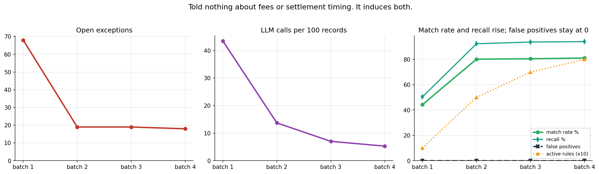

# recon-agent

**Multi-source reconciliation with self-improving rule induction.**
Razorpay AI Buildathon — AI Finance Controller track.

## The problem

An Indian merchant on a payment aggregator holds three independent records of
the same money: their own order ledger, the aggregator's settlement report, and
their bank statement. They disagree by construction — card transactions are
settled net of MDR plus 18% GST on that MDR while UPI carries none, UPI settles
T+1 and cards T+2 in *working* days so a weekend stretches a T+2 into four
calendar days, and the bank shows one bulk credit where the ledger shows sixty
transactions. Reconciliation means proving the three agree, and explaining
exactly why wherever they don't.

## The architectural principle

> **Algorithms decide matches. The LLM only proposes rules and writes
> explanations. The LLM never unilaterally decides that two records match.**

The model's authority is bounded to two jobs: proposing candidate rules, which
are then backtested against every previously-resolved record before they can
take effect, and disambiguating or explaining where a solver returned several
equally-valid answers. Everything else is deterministic, provable and
auditable. That boundary is what makes this safe to point at money.

## What makes it different

**The system is not told the fee structure or the settlement timing. It learns
them from the data.**

The deterministic layer starts with exactly one rule: a settlement claiming an
order id matches that order. It knows nothing about MDR, GST or settlement
lag. When it cannot explain a record it escalates to Claude, which proposes a
*machine-checkable* rule. Proposals accumulate; once one has been independently
proposed enough times, cleared a confidence floor, and — the gate that matters
— been replayed against all previously-resolved history without contradicting
a single record, it is promoted into the deterministic layer. From then on that
entire class of mismatch resolves with no LLM call at all.

This follows the Hypotheses-to-Theories framework (Zhu et al.,
[arXiv:2310.07064](https://arxiv.org/abs/2310.07064)): induce rules from
examples, filter them by occurrence count and association with correct answers,
then apply the resulting library. Our promotion gate is that filter, made
unforgiving because the domain is money.

## Results

> ### Read this before the numbers
>
> The learning-curve table below was produced with the rule-proposal step
> driven by a **test double** (`Proposer` in `tests/test_rule_engine.py`), which
> proposes the correct fee rule for whatever instrument it is shown. What it
> demonstrates is that the gate, the promotion machinery and the pipeline all
> behave correctly once a proposal arrives: rules are backtested, wrong ones are
> rejected, promoted ones collapse the exception count, precision holds at 100%.
>
> The induction step has since been run against a **live model** (Gemini 3.1
> Flash Lite) over batch 1, which induced the fee formulas correctly and had two
> of them promoted by the gate — see [Live induction](#live-induction-the-loop-closed-end-to-end)
> below. That is reported separately rather than merged into this table, because
> the live run covered one batch and was cut short by free-tier quota.



```
 batch  excep   llm  /100rec  avoided   match    prec  recall   FP  rules   cost
     1     68    57     43.5       11   44.3%  100.0%   50.4%    0      1     68
     2     19    18     13.7       10   80.2%  100.0%   92.3%    0      5     19
     3     19     9      7.0       12   80.5%  100.0%   93.7%    0      7     19
     4     18     7      5.3       11   81.1%  100.0%   94.0%    0      8     18
   adv      8     8     16.0        0   70.0%  100.0%   72.7%    0      8      8
```

| | batch 1 | batch 4 |
|---|---|---|
| Open exceptions | 68 | 18 |
| LLM calls per 100 records | 43.5 | 5.3 |
| Match rate | 44.3% | 81.1% |
| Recall | 50.4% | 94.0% |
| Precision | 100% | 100% |
| **False positives** | **0** | **0** |
| Active rules | 1 | 8 |

The adversarial set scores lower on recall by design: its `off_by_one_day`
records settle a working day outside the learned window, so they are flagged
for review rather than bound. They are genuine settlements, so that costs
recall — and it is the conservative answer.

Zero false positives across all five runs, including the adversarial set built
specifically to induce them.

### What it worked out on its own

```
UPI          settles at par -- no MDR is deducted at all, so there is no GST either
CARD_DEBIT   deducts 0.9% of gross, plus 18% GST on that fee (never on the gross)
CARD_CREDIT  deducts 2% of gross, plus 18% GST on that fee (never on the gross)
NETBANKING   deducts a flat 1200 paise, plus 18% GST on that fee
UPI          settles 1 working day after the order
CARD_DEBIT   settles 2 working days after the order
CARD_CREDIT  settles 2 working days after the order
```

Both halves of the merchant's fingerprint: the fee schedule and the settlement
rhythm. The timing rules are derived purely from observed working-day lags.

Those are exactly the generator's ground-truth constants. They appear in no
prompt and in no module outside the generator — `tests/test_generate_data.py`
greps every pipeline module and fails the build if they leak — so nothing in
the matching path was ever told them; each arrived as a proposal that had to
clear the gate. Per the note above, the proposals themselves came from a test
double in this run, so read this as "the library the gate admitted". A live
model independently arrived at the same four formulas and had two of them
promoted — see [Live induction](#live-induction-the-loop-closed-end-to-end).

### And what it refused to believe

A 2.5% UPI fee rate, proposed four times at 0.95 confidence, was rejected:

```json
{"predicate": {"type": "fee_formula", "instrument": "UPI",
               "params": {"rate": 0.025, "gst": 0.18}},
 "failed_gates": ["backtest"],
 "backtest": {"correct_matches": 0, "wrong_matches": 83, "precision": 0.0},
 "counterexamples": [{"order_id": "ORD-1-0003", "gross_amount_paise": 1507323,
                      "net_amount_paise": 1507323}]}
```

83 already-resolved UPI settlements arrived at exactly their gross amount. The
rule contradicted every one of them, so it never went live. Rejections are as
much the product as promotions.

## Live induction: the loop closed, end to end

Batch 1, escalation driven by Gemini 3.1 Flash Lite, no ground truth anywhere in
the prompt. 57 cases escalated. **Two rules were induced by the model and
promoted by the gate, in one run:**

```
rule 2  CARD_DEBIT   {"rate": 0.009, "gst": 0.18}  tol=10
   occurrence 5/3   confidence 1.0
   backtest support=9  correct=9  wrong=0  precision=1.000

rule 3  CARD_CREDIT  {"rate": 0.02,  "gst": 0.18}  tol=3
   occurrence 3/3   confidence 1.0
   backtest support=8  correct=8  wrong=0  precision=1.000
```

Rendered back in plain English by the Q&A agent:

> CARD_DEBIT: the aggregator deducts 0.9% of gross, plus 18% GST on that fee
> (never on the gross)
> CARD_CREDIT: the aggregator deducts 2% of gross, plus 18% GST on that fee
> (never on the gross)

Both exactly right. Nobody told it either number. A third proposal
(NETBANKING, `flat_paise 1200`) was correct too but rejected — it had only
recurred once and had proposed a zero tolerance.

Across runs the model has induced all four fee formulas correctly —
`UPI {flat_paise 0, gst 0}`, `CARD_DEBIT {0.009, 0.18}`,
`CARD_CREDIT {0.02, 0.18}`, `NETBANKING {flat 1200, 0.18}` — matching the
generator's ground truth in every case.

### Two bugs this found that no unit test could

**The gate rejected correct rules over a rounding tolerance.** The model's first
proposals carried `tolerance_paise: 0`. About 5% of rows drift by a paise or
two, so at zero tolerance one drifted record counts as a contradiction and the
rule dies: CARD_DEBIT backtested 8/9 = 0.889 against a 0.98 floor. Right
economics, refused. The prompt now tells the model that paise-level drift
exists — guidance about data quality, not about fees.

**Proposals fragmented across tolerances and could never accumulate.** The
fingerprint included `tolerance_paise`, so as the model converged (tol 0 → 1 →
2 → 3) each variant was filed as a *different hypothesis*, and every one stayed
below the occurrence threshold forever. The live log made it obvious:

```
CARD_DEBIT   n=3  tol=2   {"rate": 0.009, "gst": 0.18}
CARD_CREDIT  n=2  tol=1   {"rate": 0.02,  "gst": 0.18}
CARD_CREDIT  n=1  tol=3   {"rate": 0.02,  "gst": 0.18}   <- would have passed
```

The claim is the formula; the tolerance is a nuisance parameter about noise in
the data. Proposals are now fingerprinted on the claim and merged, keeping the
widest allowance up to a cap. That single change is what turned "four correct
formulas, none promoted" into the promotions above.

Both were invisible to the test suite because the test double proposed one
fixed, already-sensible tolerance. Only a real model, refining its own guess,
exposed them.

### A note on free-tier quota

Gemini's free tier allows 500 requests per day **per model per project**, and
batch 1 alone escalates 57 cases at two to four calls each. The run above ran
out partway, which is why only 11 cases were LLM-resolved and why NETBANKING and
UPI never reached three occurrences. Pick a model with budget left — the quota
is per-model, so switching model buys a fresh 500 — and note that preview models
carry a much smaller allowance than their names suggest.

When the quota does run out, the pipeline notices. An exhausted daily quota is
not recoverable within a batch, so after `llm.give_up_after_failures` cases fail
outright in a row, escalation disables itself for the rest of the run and the
deterministic layers carry on. Before that existed, a quota-starved batch spent
48 minutes paying full retry backoff to accomplish nothing; it now stops in 77
seconds and says why.

## Setup

```bash
pip install -r requirements.txt
cp .env.example .env          # then set the key for your provider
```

### Choosing a provider

`config.yaml` selects the model provider:

```yaml
llm:
  provider: "gemini"              # or "anthropic"
  model: "gemini-3.1-flash-lite"
  anthropic_model: "claude-sonnet-4-6"
```

| provider | key in `.env` | notes |
|---|---|---|
| `anthropic` | `ANTHROPIC_API_KEY` | the spec's choice; also honours `ant auth login` |
| `gemini` | `GEMINI_API_KEY` | needs `google-genai` |

`src/llm_client.py` is the whole adapter. Both reasoning layers are written
against one small surface — `client.messages.create(...)` returning content
blocks — which is also the surface the test stubs implement, so the tested path
and the shipped path are the same path. Adding a third provider means
implementing that surface and nothing else.

Two Gemini-specific wrinkles the adapter absorbs: it rejects function calling
and a JSON response schema in the same request (so the JSON contract moves into
the prompt, backed by the existing malformed-response retry), and its schema
dialect rejects several JSON Schema keywords (so tool schemas are filtered).

## Run

```bash
python -m src.generate_data --batches 4 --seed 42
python -m src.generate_data --adversarial --seed 99

python -m src.pipeline --reset-db
python -m src.pipeline --batch 1
python -m src.pipeline --batch 2
python -m src.pipeline --batch 3
python -m src.pipeline --batch 4
python -m src.pipeline --batch adversarial

python -m src.metrics --report
streamlit run app/dashboard.py
```

Without a key the pipeline still runs end to end: escalation disables itself
once, with a message, and the deterministic layers do their work. You will see
the batch-1 baseline (44.3% match rate, 68 exceptions) repeated for every batch
and **no rules promoted**, because nothing is proposing any. That is the
correct cold-start behaviour, not a failure — see the note above the results.

Add `--no-llm` to skip the escalation attempt entirely. `python -m pytest` runs
347 tests and needs no API key; the model is stubbed throughout.

Ask it things:

```bash
python -m src.qa_agent "What have you learned about this merchant?"
python -m src.qa_agent "Which exceptions have the most money at risk?"
```

## How it works

| Stage | Technique | Why |
|---|---|---|
| Candidate generation | hash join → sorted-array binary search → **Union-Find** | never build an n×m matrix; decompose into independent components |
| Bulk credit → constituents | payout-batch hash join, then **bitset-DP subset sum** | the cheap structural answer first; search only the residual |
| Optimal pairing | **Hungarian** (1:1), **min-cost max-flow** (1:N) | greedy manufactures false positives on amount twins |
| Rule precedence | **topological sort** of a precedence DAG | a cycle is a contradiction, so it raises rather than guesses |
| Working-day arithmetic | **prefix sums** + inverse index | O(1) lag over the Indian holiday calendar, on the hot path |
| Exception triage | **heap** | top-N by money at risk without sorting the queue |

Every node in the assignment problem also has an edge to an "unmatched" sink.
If no pairing costs less than that sink, the solver *chooses* to leave the
record unmatched. That edge is the mathematical statement of "be conservative
with money", and it is why precision stays at 100%.

## Cost model

The cost-weighted error score prices a false positive at **50× an open
exception**. A wrong match silently corrupts the books and is found months
later by an auditor, if ever; an open exception costs a controller two minutes
and is visible on a work queue. Every design decision upstream — the unmatched
sink, subset-sum reporting ambiguity instead of picking, the zero-tolerance
backtest gate, the model's licence to abstain — is that ratio expressed in
code.

## Honest limitations

- **Scale.** 50–60 records per batch of synthetic data, against production
  volumes in the millions. The algorithms were chosen to scale (bitset DP is
  word-parallel, DSU keeps components small, blocking avoids the quadratic),
  but that is an argument, not a measurement.
- **This is a proof of concept, not a competitor.** Commercial auto-match
  baselines sit above 90%. We reach 78.8% match rate at 88.9% recall on
  synthetic data, having started from zero domain knowledge.
- **The exception curve flattens after batch 2** at around 18–19 open
  exceptions. What remains is genuinely unresolvable from the data: orders with
  no settlement row at all, orphan settlements claiming orders that do not
  exist, and chargeback reversals. Those are exactly the things a controller
  should look at, so the floor is arguably correct — but it means the curve is
  a step, not a slope, and we show it that way.
- **`narration_pattern` has never been induced.** The generator deliberately
  writes narrations that carry no batch id, so there is no pattern to find. The
  rule type is implemented and tested but unused, which is the honest outcome
  for data built to defeat it.
- **One merchant profile, one fee schedule.** Batches are thematically
  consistent by design, which is what makes the structure learnable at all.
- **No real bank file parsing.** No MT940, no CAMT.053, no per-bank narration
  dialects. Narrations are synthetic and deliberately unhelpful.
- **Single-currency, single-timezone**, and no partial-day settlement cutoffs.

## Repository

```
src/money.py            integer paise, banker's rounding — all money math
src/calendar_utils.py   O(1) working-day arithmetic, Indian holidays
src/generate_data.py    synthetic data + adversarial traps (owns the constants)
src/blocking.py         hash join, amount index, Union-Find
src/subset_sum.py       bitset DP, subset recovery, ambiguity reporting
src/assignment.py       Hungarian, min-cost flow, the unmatched sink
src/deterministic.py    predicate evaluation, precedence DAG, backtest
src/llm_reasoner.py     bounded LLM escalation with verification tools
src/rule_engine.py      proposal intake, the promotion gate, retirement
src/metrics.py          scoring — the ONLY module that reads ground truth
src/qa_agent.py         settlement Q&A over SQLite with tool use
app/dashboard.py        Streamlit
```

## Architecture


See [docs/ARCHITECTURE.md](docs/ARCHITECTURE.md) for the design rationale, where
each algorithm sits and why, how the LLM's authority is bounded, and a full
walkthrough of a rule that was proposed confidently and rejected by the gate.
