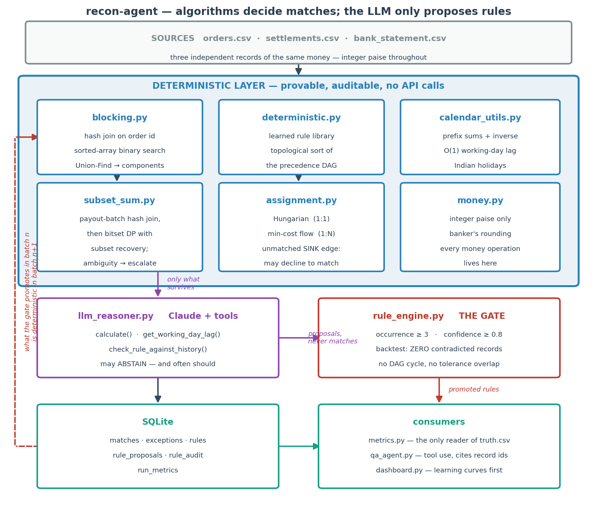

# recon-agent

**A deterministic three-way reconciliation engine that proves you were charged
what you agreed to — and uses an LLM only to propose rules, never to decide a
match.**

Razorpay AI Buildathon — AI Finance Controller track.

## The problem

An Indian merchant on a payment aggregator holds three independent records of
the same money: their own order ledger, the aggregator's settlement report, and
their bank statement. They disagree by construction — card transactions are
settled net of MDR plus 18% GST on that MDR while UPI carries none, UPI settles
T+1 and cards T+2 in *working* days so a weekend stretches a T+2 into four
calendar days, and the bank shows one bulk credit where the ledger shows sixty
transactions. Reconciliation means proving the three agree, and explaining
exactly why wherever they don't.

## What it does

**It proves you were charged what you agreed to.**

The merchant's contracted rates are an *input* — they are in the signed
agreement, and every merchant has them. The settlement data is the thing under
audit. For every transaction the system compares the fee actually deducted
against the fee the contract allows, and reports the difference in rupees
against named transactions.

```
CONTRACT COMPLIANCE
instrument        contracted      observed     n  verdict
UPI                       0%            0%    26  matches contract
CARD_DEBIT              0.9%         0.95%     5  >>> DEVIATES FROM CONTRACT
CARD_CREDIT               2%          2.1%     9  >>> DEVIATES FROM CONTRACT
NETBANKING        flat 1200p    flat 1300p     3  >>> DEVIATES FROM CONTRACT

Fee leakage across 43 transactions:  ₹399.33
  17 transactions charged more than the contract allows
    CARD_CREDIT          ₹335.78   over 9 transactions
    CARD_DEBIT            ₹60.01   over 5 transactions

  worst single transactions:
    STL-HYYZ2XKN  CARD_CREDIT  charged ₹1,169.72, agreed ₹1,114.03, over by ₹55.69
```

Nobody told it the rates had changed. It read what was actually deducted and
held it against the contract.

### Why this direction, and not the other one

An earlier version of this project did the opposite: it *induced* the fee
schedule from settlement data and matched against what it found. That is
backwards, and we are documenting it because the mistake is instructive.

If the aggregator quietly bills 2.1% against a contracted 2.0%, a system that
learns from their output observes 2.1%, finds it perfectly consistent with
history, promotes it, and then silently marks every overcharged transaction as
correct. It launders the leakage into the books **and reports 100% precision
while doing it.** Reconciliation exists to verify that what happened matches
what was *agreed*; learning the rules from one party's own output subverts the
entire purpose.

Worse, the induction was not even necessary. Fifteen lines of arithmetic
recover the schedule exactly, with no model, no API calls and no promotion
gate:

```
CARD_CREDIT  percentage fee ≈ 2.000%      CARD_DEBIT  percentage fee ≈ 0.900%
NETBANKING   flat fee ≈ 1200 paise        UPI         percentage fee ≈ 0.000%
implied GST = 0.18
```

That is `observed_schedule()` in `src/contract.py`, and it is the honest
baseline. **No inference machinery gets to claim credit for discovering a
number that plain statistics recovers for free — or that the merchant already
has in a contract.**

### What a full live run found

The whole sequence was run against a live model (Gemini 3.1 Flash Lite), six
batches, 41 minutes. It promoted five rules unaided — all four fee formulas in
**batch 1 alone**, and the refund pattern by batch 4 — and escalations fell from
57 in batch 1 to 8 by batch 4.

It also produced **53 false positives, and every single one came from the same
place**: the path where the model's own `match` verdict was allowed to write a
match. Not one came from any deterministic path.

```
resolver        false positives
llm                          53
deterministic                 0
subset_sum                    0
hungarian / mincostflow       0
```

The reasoning is worth reading, because it is a specific and repeatable error:

> *"The net amount is correctly derived by subtracting the MDR and GST on MDR
> from the gross amount"* — confidence 1.0

That checks the settlement against **itself**. It proves the aggregator can
subtract and says nothing about whether this settlement belongs to that order —
the same mistake the deterministic evaluator made earlier and had fixed. One
match even reasoned that the amount was *"significantly different"* and matched
it anyway, at confidence 1.0.

A confidence floor cannot filter this. The model is confidently wrong, not
hesitantly wrong.

**So the model's verdict is now advisory: it is recorded on the exception for
the human and never applied.** The whole sequence was then re-run live with that
change, and these numbers are measured, not derived:

```
 batch  excep   llm   match     prec  recall   FP  rules  promoted   leakage
     1     68   225   44.3%   100.0%   50.4%    0      1         4     ₹0.00
     2     21    56   78.6%   100.0%   90.6%    0      5         0     ₹0.00
     3     23    50   77.3%   100.0%   90.1%    0      5         0     ₹0.00
     4     19    46   80.3%   100.0%   93.2%    0      5         0     ₹0.00
     5     39   122   68.7%   100.0%   76.0%    0      5         0   ₹399.33
   adv      5     0   82.0%   100.0%   79.5%    0      5         0     ₹0.00
```

**Precision 100% on every batch, zero false positives, zero model-written
matches** — against 53 false positives from that path in the run before the
change. Recall is unaffected, which means all 53 had been wrong: the model's
match verdicts scored **0/53**. Declining them costs nothing.

The model still promoted all four fee formulas in batch 1 alone, unaided:

```
UPI          settles at par -- no MDR is deducted at all
CARD_DEBIT   0.9% of gross, plus 18% GST on that fee
CARD_CREDIT  2% of gross, plus 18% GST on that fee
NETBANKING   a flat 1200 paise, plus 18% GST on that fee
```

And batch 5 -- the month the aggregator quietly raised its rates -- was caught
by the contract audit at ₹399.33 across 17 transactions, while the gate refused
to promote the new rates because they contradict four batches of history.

This is the architectural principle catching the code that violated it: the
README already said the LLM never decides a match, and only running it live
revealed that the code was more permissive than the claim.

### So what is the LLM still for?

Two things, and it is fenced out of everything else:

> **Algorithms decide matches. The LLM only proposes rules and writes
> explanations. It never unilaterally decides that two records match.**

Every rule it proposes is a machine-checkable predicate that must survive a
gate — proposed independently at least three times, above a confidence floor,
and replayed against every previously-resolved record without contradicting
one. A rule it proposed confidently ("UPI charges 2.5%") was rejected after the
gate found 83 already-resolved UPI settlements that arrived with no fee at all.

That governance pattern is the transferable contribution. The fee induction is
a demonstration vehicle for it, not the product.

## Results

The reconciliation engine itself is what does the work, and it gets cheaper as
it learns. Four honest batches, then batch 5 — the month the aggregator quietly
raised its rates.

```
 batch  excep   llm  /100rec  match    prec  recall   FP  rules
     1     68    58     44.3  44.3%  100.0%   50.4%    0      1
     2     19    20     15.3  80.2%  100.0%   92.3%    0      5
     3     14     5      3.9  84.4%  100.0%   98.2%    0      8
     4     12     1      0.8  85.6%  100.0%   99.2%    0      9
     5     33    24     17.9  73.1%  100.0%   80.8%    0      9   <- rates changed
   adv      5     5     10.0  76.0%  100.0%   79.5%    0      9
```

Two things to read here.

**Batches 1-4:** exceptions fall 68 → 12 and model calls fall from 44 per 100
records to under one, while precision holds at 100% and false positives stay at
zero — including on an adversarial set built specifically to induce them.

**Batch 5 is the interesting row.** Exceptions jump back to 33 and model calls
to 24, because the learned rules stop explaining the data. The system does not
quietly adapt to the new rates; it **notices, refuses, and escalates.** The
contract audit then prices exactly what changed. A system that had learned its
rules from the aggregator would have absorbed the increase without a sound.

## Setup

```bash
pip install -r requirements.txt
cp .env.example .env          # then set the key for your provider
```

### Choosing a provider

`config.yaml` selects the model provider:

```yaml
llm:
  provider: "gemini"              # or "anthropic"
  model: "gemini-3.1-flash-lite"
  anthropic_model: "claude-sonnet-4-6"
```

| provider | key in `.env` | notes |
|---|---|---|
| `anthropic` | `ANTHROPIC_API_KEY` | the spec's choice; also honours `ant auth login` |
| `gemini` | `GEMINI_API_KEY` | needs `google-genai` |

`src/llm_client.py` is the whole adapter. Both reasoning layers are written
against one small surface — `client.messages.create(...)` returning content
blocks — which is also the surface the test stubs implement, so the tested path
and the shipped path are the same path. Adding a third provider means
implementing that surface and nothing else.

Two Gemini-specific wrinkles the adapter absorbs: it rejects function calling
and a JSON response schema in the same request (so the JSON contract moves into
the prompt, backed by the existing malformed-response retry), and its schema
dialect rejects several JSON Schema keywords (so tool schemas are filtered).

## Run

```bash
python -m src.generate_data --batches 4 --seed 42
python -m src.generate_data --adversarial --seed 99
python -m src.generate_data --batch 5 --seed 42 --overcharge   # rates quietly raised

python -m src.pipeline --reset-db
python -m src.pipeline --batch 1
python -m src.pipeline --batch 2
python -m src.pipeline --batch 3
python -m src.pipeline --batch 4
python -m src.pipeline --batch adversarial

python -m src.metrics --report
python -m src.metrics --contract        # were you charged what you agreed to?
streamlit run app/dashboard.py
```

Without a key the pipeline still runs end to end: escalation disables itself
once, with a message, and the deterministic layers do their work. You will see
the batch-1 baseline (44.3% match rate, 68 exceptions) repeated for every batch
and **no rules promoted**, because nothing is proposing any. That is the
correct cold-start behaviour, not a failure — see the note above the results.

Add `--no-llm` to skip the escalation attempt entirely. `python -m pytest` runs
349 tests and needs no API key; the model is stubbed throughout.

Ask it things:

```bash
python -m src.qa_agent "What have you learned about this merchant?"
python -m src.qa_agent "Which exceptions have the most money at risk?"
```

## How it works

| Stage | Technique | Why |
|---|---|---|
| Candidate generation | hash join → sorted-array binary search → **Union-Find** | never build an n×m matrix; decompose into independent components |
| Bulk credit → constituents | payout-batch hash join, then **bitset-DP subset sum** | the cheap structural answer first; search only the residual |
| Optimal pairing | **Hungarian** (1:1), **min-cost max-flow** (1:N) | greedy manufactures false positives on amount twins |
| Rule precedence | **topological sort** of a precedence DAG | a cycle is a contradiction, so it raises rather than guesses |
| Working-day arithmetic | **prefix sums** + inverse index | O(1) lag over the Indian holiday calendar, on the hot path |
| Exception triage | **heap** | top-N by money at risk without sorting the queue |

Every node in the assignment problem also has an edge to an "unmatched" sink.
If no pairing costs less than that sink, the solver *chooses* to leave the
record unmatched. That edge is the mathematical statement of "be conservative
with money", and it is why precision stays at 100%.

## Cost model

The cost-weighted error score prices a false positive at **50× an open
exception**. A wrong match silently corrupts the books and is found months
later by an auditor, if ever; an open exception costs a controller two minutes
and is visible on a work queue. Every design decision upstream — the unmatched
sink, subset-sum reporting ambiguity instead of picking, the zero-tolerance
backtest gate, the model's licence to abstain — is that ratio expressed in
code.

## Honest limitations

- **Scale.** 50–60 records per batch of synthetic data, against production
  volumes in the millions. The algorithms were chosen to scale (bitset DP is
  word-parallel, DSU keeps components small, blocking avoids the quadratic),
  but that is an argument, not a measurement.
- **This is a proof of concept, not a competitor.** Commercial auto-match
  baselines sit above 90%. We reach 78.8% match rate at 88.9% recall on
  synthetic data, having started from zero domain knowledge.
- **The exception curve flattens after batch 2** at around 18–19 open
  exceptions. What remains is genuinely unresolvable from the data: orders with
  no settlement row at all, orphan settlements claiming orders that do not
  exist, and chargeback reversals. Those are exactly the things a controller
  should look at, so the floor is arguably correct — but it means the curve is
  a step, not a slope, and we show it that way.
- **`narration_pattern` has never been induced.** The generator deliberately
  writes narrations that carry no batch id, so there is no pattern to find. The
  rule type is implemented and tested but unused, which is the honest outcome
  for data built to defeat it.
- **One merchant profile, one fee schedule.** Batches are thematically
  consistent by design, which is what makes the structure learnable at all.
- **No real bank file parsing.** No MT940, no CAMT.053, no per-bank narration
  dialects. Narrations are synthetic and deliberately unhelpful.
- **Single-currency, single-timezone**, and no partial-day settlement cutoffs.

## Repository

```
src/money.py            integer paise, banker's rounding — all money math
src/calendar_utils.py   O(1) working-day arithmetic, Indian holidays
src/generate_data.py    synthetic data + adversarial traps (owns the constants)
src/blocking.py         hash join, amount index, Union-Find
src/subset_sum.py       bitset DP, subset recovery, ambiguity reporting
src/assignment.py       Hungarian, min-cost flow, the unmatched sink
src/deterministic.py    predicate evaluation, precedence DAG, backtest
src/llm_reasoner.py     bounded LLM escalation with verification tools
src/rule_engine.py      proposal intake, the promotion gate, retirement
src/metrics.py          scoring — the ONLY module that reads ground truth
src/qa_agent.py         settlement Q&A over SQLite with tool use
app/dashboard.py        Streamlit
```

## Architecture



See [docs/ARCHITECTURE.md](docs/ARCHITECTURE.md) for the design rationale, where
each algorithm sits and why, how the LLM's authority is bounded, and a full
walkthrough of a rule that was proposed confidently and rejected by the gate.
